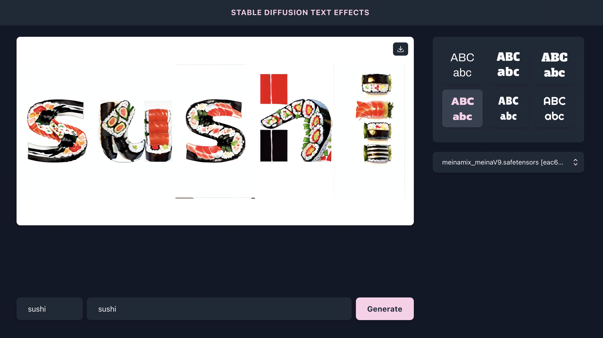
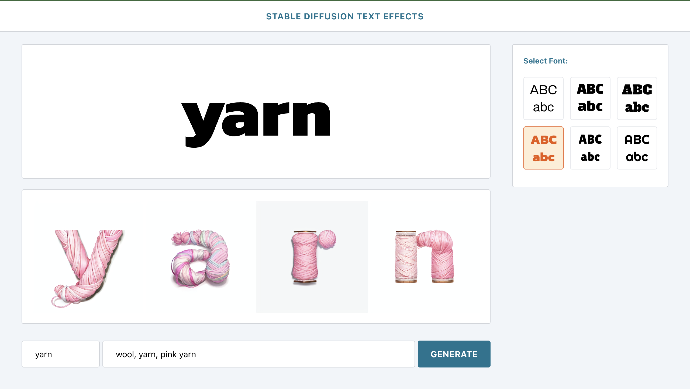
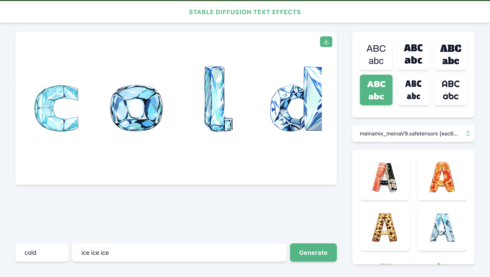

# Stable Diffusion Text Effects

Inspired by Adobe Firefly's text effects, Stable Diffusion Text Effects allows you to create mesmerizing and unique text effects with the power of stable diffusion algorithms.





## Prerequisites

1. Install Stable Diffusion Web UI by AUTOMATIC1111. [Follow these steps.](https://github.com/AUTOMATIC1111/stable-diffusion-webui#installation-and-running)
2. Download the [MeinaMix](https://civitai.com/models/7240/meinamix) model and place it inside `stable-diffusion-webui/models/Stable-diffusion`
3. Download the [lineart ControlNet model](https://huggingface.co/ControlNet-1-1-preview/control_v11p_sd15_lineart) and place it inside `stable-diffusion-webui/extensions/sd-webui-controlnet/models`

## Steps to Install

1. Clone Stable Diffusion Text Effects to your local machine: `git clone https://github.com/ihsavru/sd-text-effects.git`
2. Install the dependencies using `yarn`.
3. `cd` into `stable-diffusion-webui` and run the following command to start the Stable Diffusion API:
  ```
  ./webui.sh --nowebui --cors-allow-origins http://localhost:3000 --api-log
  ```
4. To run the Stable Diffusion Text Effects app, `cd` into `sd-text-effects` and use the following command:
  ```
  yarn start
  ```
5. Once the development server is running, you can access the app by opening your web browser and navigating to [localhost:3000](http://localhost:3000).
