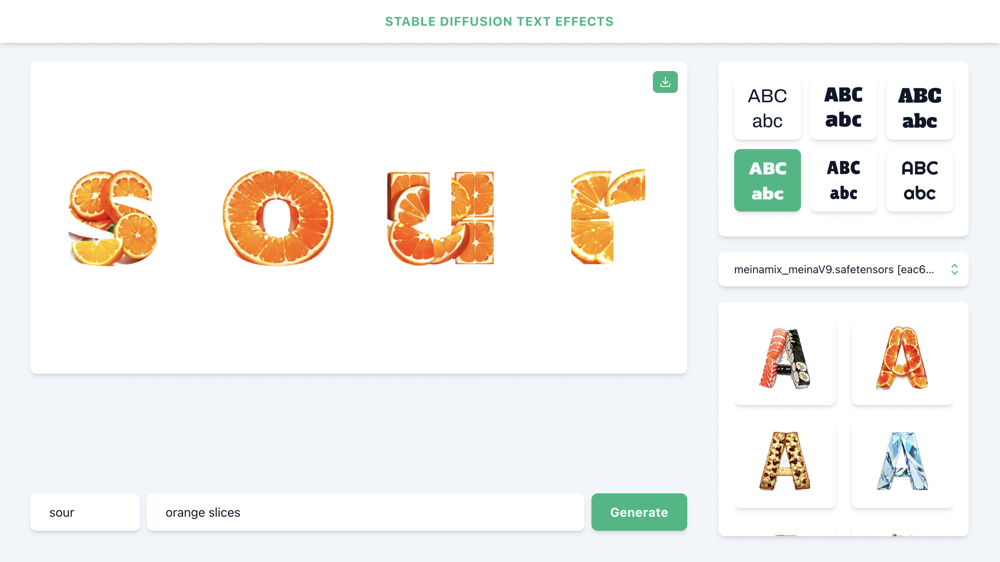

# Stable Diffusion Text Effects

Inspired by Adobe Firefly's text effects, Stable Diffusion Text Effects allows you to create mesmerizing and unique text effects with the power of stable diffusion algorithms.





## Steps to Install

1. Install Stable Diffusion Web UI by AUTOMATIC1111. [Follow these steps.](https://github.com/AUTOMATIC1111/stable-diffusion-webui#installation-and-running)
2. Clone Stable Diffusion Text Effects to your local machine: `git clone https://github.com/ihsavru/sd-text-effects.git`
3. Install the dependencies using `yarn`.
4. `cd` into `stable-diffusion-webui` and run the following command to start the Stable Diffusion API:
  ```
  ./webui.sh --api --cors-allow-origins=http://127.0.0.1:3000 --nowebui
  ```
5. To run the Stable Diffusion Text Effects app, `cd` into `sd-text-effects` and use the following command:
  ```
  yarn start
  ```
6. Once the development server is running, you can access the app by opening your web browser and navigating to [localhost:3000](http://localhost:3000).
